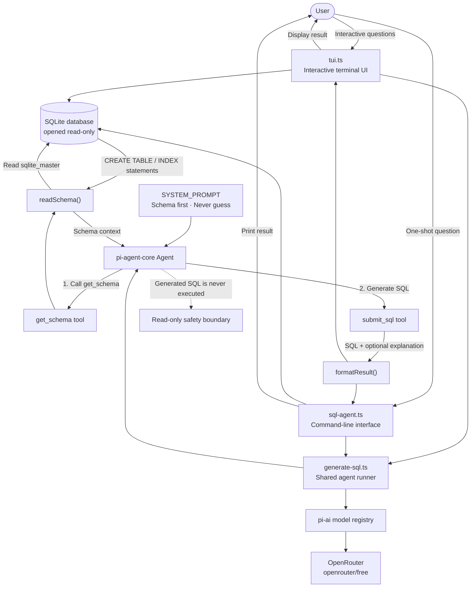

# Playground

A collection of small experiments with AI agents and developer tooling. The
repository currently contains `sql-agent`, a command-line tool that turns
natural-language questions into SQLite queries.

## Projects

### SQL Agent

`sql-agent/` uses
[`@earendil-works/pi-agent-core`](https://github.com/earendil-works/pi) and
OpenRouter to inspect a SQLite schema and generate a matching SQL statement.
It does **not** execute generated SQL. The database is opened read-only, and
the agent can only read schema definitions and submit its final query.

## Architecture



## Requirements

- Node.js 24 or newer
- An [OpenRouter](https://openrouter.ai/) API key for live generation

## Quick Start

```bash
cd sql-agent
npm install
cp .env.example .env
# Add your OPENROUTER_API_KEY to .env
npm run seed
npm run tui
```

The default `openrouter/free` model router is suitable for development and
low-volume testing. Free-model availability and rate limits can vary.

The terminal interface supports repeated questions and includes `:schema`,
`:clear`, `:help`, and `:quit` commands. For a single non-interactive request,
run:

```bash
npm start -- example.sqlite "How many orders did each customer place?"
```

## Development

Run the automated tests without an API key:

```bash
cd sql-agent
npm test
npm run test:coverage
```

The test suite uses Node's built-in test runner and in-memory SQLite databases.
There is no build step; supported Node versions run the TypeScript sources
directly.

## Repository Layout

```text
.
├── sql-agent/
│   ├── sql-agent.ts       # CLI and live model wiring
│   ├── tui.ts             # Interactive terminal interface
│   ├── generate-sql.ts    # Shared live-agent runner
│   ├── lib.ts             # Testable schema and tool logic
│   ├── test/              # Unit tests
│   └── example.sqlite     # Seeded demonstration database
├── AGENTS.md              # Contributor guidance
└── CLAUDE.md              # Claude Code project context
```

See [`sql-agent/README.md`](sql-agent/README.md) for implementation details and
[`AGENTS.md`](AGENTS.md) before contributing.
